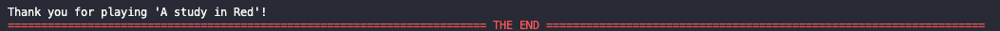

## T1A3 Camilla De Pretto - Terminal Application
Terminal application submitted for Coder Academy diploma. 

The application is a text-based terminal, born from my interest in mystery games and stories like Arthur C. Doyle's 'Sherlock Holmes', the name itself is a reference to the first book of the Sherlock Holmes series. 

### Github online repository link
[Github repository](https://github.com/camilla-cs/TERMINALAPP_T1A3)

### Style guide convention used: 
[Google Python style guide](https://google.github.io/styleguide/pyguide.html)

### Help documentation: 
This app needs Python3 installed to be used successfully.

Open the terminal , preferably in VSCode.

Run `chmod +x ./src/packages.sh` to install the packages.

Then run `./src/packages.sh`.

Finally, to run the app write `./src/run.sh` in the terminal. \
In case the bash script doesn't run properly, please run `python3 ./src/main.py`. 

### Features: 
The main features of 'A Study in Red' are: 
+ Program - user interaction \
 There's a continuous interaction between the program and the user throughout the entire use of the terminal application through an input-output relationship. \
 From the beginning, the user will have to choose a username that will be returned as well as the role they will have in the game. \
 The user will try to catch the responsible for the crime starting from the main option menu, that is gonna appear after a brief introduction, where they can choose between investigating the crime scene, interviewing the suspects, use the notebook, make an accusation or quit the game. 

+ Character depth \
 For the text-based game to be successful, it was necessary to create suspects with a motive and an alibi. There are a total of five suspects, each own with their own alibi and motives. It's up to the user to try to catch the killer by examining the evidence and reasoning about the suspects' interviews. 

+  Notebook \
 The notebook is a feature on its own because the user can add, remove, edit, and view the notes they wrote with just a single input from the keyboard. \
 It's a useful tool to write down what the user thinks the killer is. 

### Walkthrough: 

After running the code for starting the program the title will appear, and the user will be asked to input an username.

There is an introduction where it is said that the user is a detective assigned to a homicide case and has to catch the killer. 

The main menu consists of choosing from 5 options: 1. investigate the crime scene, 2. interview the suspects, 3. use the notebook, 4. make the final accusation and quit the game. \
In the code I implemented a function that will display the possible choices, a while loop that will run as long as the input is not 5 (the option to quit the game) with if, elif,else statements for the remaining choices. Each one of them is then linked to functions put in separate modules. 

If the user chooses the first option, 'investigate the crime scene', in the terminal will appear a series of evidence and after that, the user will be able to go back to the menu by pressing enter.\
In the coding part of the app this section will be implemented by the 'crime_scene' module, which contains a simple function that prints the different evidence and asks the user to go back to the main menu. 

 

When the user wants to interview the suspects by pressing '2' in the main option menu, a list of suspects will appear. The suspects in this game are: the wife, the son, the driver, the chef and the cleaning lady. Everyone has an alibi, and most has also a motive.\
In the code I made a module called 'suspects_list_3' with a similar function used for the main menu options, followed by another which contains the suspects interviews that will be printed on the terminal through a while loop and if,elif, else choice. The else choice asks the user to put a number from the ones diplayed in case they input a different number or string. 

The notebook function can be very useful to the user who wants to write down what they remember from the evidence and interviews.

In the code, the notebook feature is made of 2 files: a csv file to input the notes and another one that will make the csv file work through a main function that contains other functions for each feature. \
The 'add note' option will have the user to input thoughts freely. That is possible through a function used only for adding notes to the csv file that is called 'file_name', the file will be opened in append mode and the newline="" parameter will make sure that everytime the user will add a note, it will be inserted in a new line in the csv file. Then the function is closed with a method that will add the note into the csv file. 

the 'remove note' function starts with a question to the user to enter the note they want to remove that will be stored in a variable, the csv file will be then opened in read-only mode. 

The notes will be stored in a class named list where the notes are read by the program and converts them in a list of lists, where each list is a row in the csv file. \
A new list will be created with the notes in the previous list will be read one by one and will be included apart from the one that matches the note to remove. The remaining notes are then re-written into the csv file. \
the 'edit note' option will ask the user to write the note they want to change and to write a new one, which will be assigned to a new variable. 

To handle errors a try-except block is used and inside that the program will open the file in read-only mode, it will iterate every note in the list to find the index of the note to edit, and it checks them by making a comparison with the variable 'note_to_edit' and if they match, it will assign an index to the note and the loop will break. \
If the note was found the program will update the content of the list at the index that was matched with the new input from the user. \
The file is then opened in write mode and the new content is updated but if the  file is not found an error message will be displayed. \
Finally the 'view notes' can be used for reviewing what has been written so far by using a try-except block in case the file doesn't exist. 

The last option is to go back to the main menu. 

If the user press '4' it will take them to the final stage of the game... catching the killer! 
In the code it has been used one function that contains the variable for the guilty suspect, and another one will ask the user to write the name of the suspect they think could be responsible for the crime. \
If that isn't the case and the user inputs an incorrect name, they will have the chance to try again. 

The last and final option from the main menu is to quit the game. 

